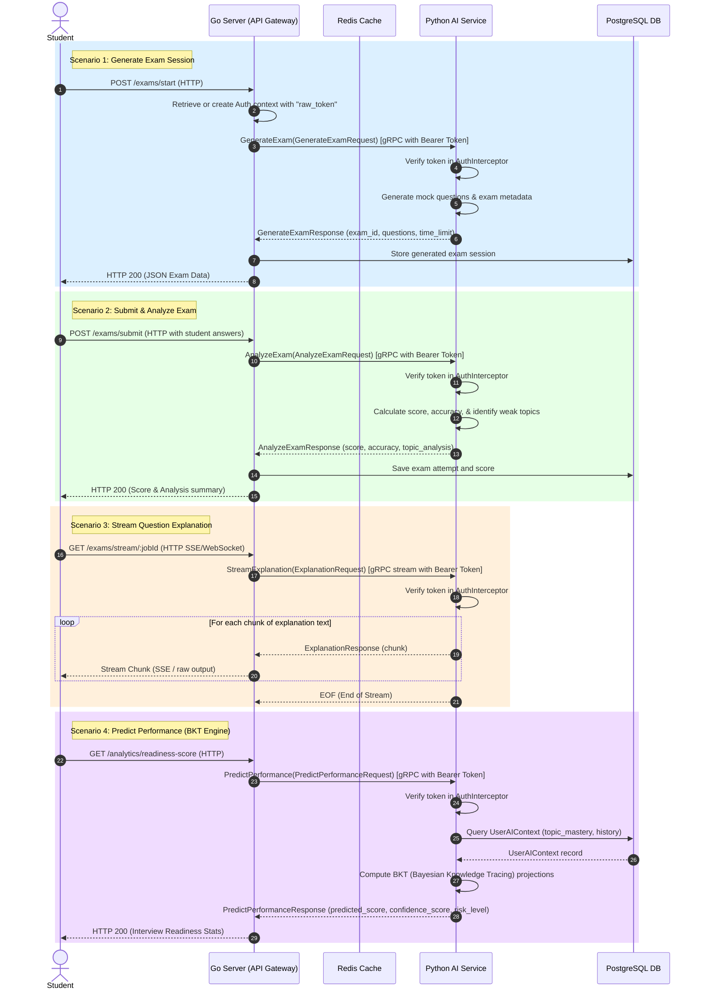

# gRPC Service Communication Analysis & Verification Report

This report documents the structure, integration, verification, and data flow of the gRPC-based services in the Examlytics platform.

---

## 1. Service Analysis & Architecture

The system utilizes gRPC for high-performance, strongly-typed internal communication between the orchestrator/API gateway and the intelligence core.

| Service | Technology Stack | Role | gRPC Role | Source Code Paths |
| :--- | :--- | :--- | :--- | :--- |
| **`server`** | Golang | API Gateway / Web Server | Client | `server/internal/infrastructure/ai/` |
| **`ai-service`** | Python | Intelligence & Analytics Core | Server | `ai-service/app/grpc_server.py` |
| **`proto`** | Protocol Buffers (v3) | Contract / Schema Definition | Shared Schema | `proto/examlytics/v1/examlytics.proto` |

### Service Contracts (`proto`)
The gRPC contract defines the `ExamlyticsAI` service with four remote procedure calls:
*   `GenerateExam` (Unary): Generates an exam template/blueprint containing AI-generated question structures.
*   `AnalyzeExam` (Unary): Processes student answers to compute score, accuracy, and topic performance analysis.
*   `StreamExplanation` (Server Streaming): Explains correct/incorrect options for a question using streamed chunks for optimal client UX.
*   `PredictPerformance` (Unary): Applies Bayesian Knowledge Tracing (BKT) based on historical database records to predict future topic accuracy and failure risk.

---

## 2. Verification of gRPC Communication

To ensure that the services communicate correctly and securely, we verified the configuration, interceptors, and all four endpoints.

### Authentication & Interceptors
*   **Security Enforcement**: The Python gRPC server (`ai-service`) implements a `ServerInterceptor` (`AuthInterceptor`) that extracts the `authorization` metadata header and validates that it contains a `Bearer <token>`.
*   **Token Propagation**: The Go gRPC client (`server`) implements matching `UnaryClientInterceptor` and `StreamClientInterceptor` that automatically extract the JWT token from the Go `context` (context key: `"raw_token"`) and append it as `Bearer <token>` to the outgoing gRPC metadata.

### Verification Results
A dedicated test harness (`server/cmd/debug/main.go`) was run to execute and verify the gRPC pipeline under both unauthenticated and authenticated states:

1.  **Unauthenticated Access Rejecting**:
    *   *Result*: **PASSED**
    *   *Details*: Requesting without authorization metadata was successfully intercepted and rejected by the Python server with `rpc error: code = Unauthenticated desc = Missing authorization`.
2.  **GenerateExam Unary Call**:
    *   *Result*: **PASSED**
    *   *Details*: Successfully returned mock exam data containing questions categorized by topic.
3.  **AnalyzeExam Unary Call**:
    *   *Result*: **PASSED**
    *   *Details*: Successfully calculated accuracy and identified weak topics (e.g., `Calculus`).
4.  **StreamExplanation Server Streaming Call**:
    *   *Result*: **PASSED**
    *   *Details*: Streamed explanation chunks sequentially over the active channel and successfully closed the connection when finished.
5.  **PredictPerformance (Database-backed) Unary Call**:
    *   *Result*: **PASSED**
    *   *Details*:
        *   *First Run (Cold Start)*: Encountered a database connection warning because the serverless Neon PostgreSQL database (Singapore AWS region) takes 3-10 seconds to spin up from an idle state.
        *   *Subsequent Run (Warm Start)*: Successfully established connection, executed BKT scoring, and returned the predicted score and risk level (`Predicted Score: 0.00`, `Risk Level: HIGH` for the non-existent dummy test user UUID).

> [!IMPORTANT]
> **Issue Identified and Fixed during Verification**:
> The Python gRPC server (`ai-service/app/grpc_server.py`) initially started without calling `load_dotenv()`. This caused `os.getenv("DATABASE_URL")` to fall back to `localhost:5432`, breaking the database-backed `PredictPerformance` call.
> **Fix Applied**: Added `dotenv.load_dotenv()` to the initialization block of `grpc_server.py` to ensure env variables from `.env` are loaded properly.

---

## 3. Data Flow Diagrams

The following diagram illustrates how data flows between the services across different request paths.

